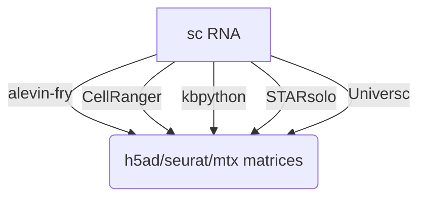

## Introduction

**nf-core/scrnaseq** is a bioinformatics best-practice analysis pipeline for processing 10x Genomics single-cell RNA-seq data.

This is a community effort in building a pipeline capable to support:

- Alevin-Fry + AlevinQC
- STARSolo
- Kallisto + BUStools
- Cellranger
- UniverSC

## Usage

First, prepare a samplesheet with your input data that looks as follows:

`samplesheet.csv`:

```csv
sample,fastq_1,fastq_2,expected_cells
pbmc8k,pbmc8k_S1_L007_R1_001.fastq.gz,pbmc8k_S1_L007_R2_001.fastq.gz,10000
pbmc8k,pbmc8k_S1_L008_R1_001.fastq.gz,pbmc8k_S1_L008_R2_001.fastq.gz,10000
```

Each row represents a fastq file (single-end) or a pair of fastq files (paired end).

> [!WARNING]
> Please provide pipeline parameters via the CLI or Nextflow `-params-file` option. Custom config files including those provided by the `-c` Nextflow option can be used to provide any configuration _**except for parameters**_;
> see [docs](https://nf-co.re/usage/configuration#custom-configuration-files).

For more details and further functionality, please refer to the [usage documentation](https://nf-co.re/scrnaseq/usage) and the [parameter documentation](https://nf-co.re/scrnaseq/parameters).

## Decision Tree for users

The nf-core/scrnaseq pipeline features several paths to analyze your single cell data. Future additions will also be done soon, e.g. the addition of multi-ome analysis types. To aid users in analyzing their data, we have added a decision tree to help people decide on what type of analysis they want to run and how to choose appropriate parameters for that.



Options for the respective alignment method can be found [here](https://github.com/nf-core/scrnaseq/blob/dev/docs/usage.md#aligning-options) to choose between methods.

## Pipeline output

To see the results of an example test run with a full size dataset refer to the [results](https://nf-co.re/scrnaseq/results) tab on the nf-core website pipeline page.
For more details about the output files and reports, please refer to the
[output documentation](https://nf-co.re/scrnaseq/output).

## Parameters

- `samplesheet_path` - Defines a path to the sheet of samples
- `custom_config_path` - Defines a path to the custom config for the pipeline including paths to the reference genome fasta and reference annotation.
- `output_storage` - Path to a storage in which to place the processing results.

## Example

`custom_config_path` file example:
```
params {
  fasta='s3://nextflow-pipeline-demo/test-configs/scrnaseq-test/reference/GRCm38.p6.genome.chr19.fa'
  gtf = 's3://nextflow-pipeline-demo/test-configs/scrnaseq-test/reference/gencode.vM19.annotation.chr19.gtf'
  // genome = 'GRCh38'

  aligner = 'star'
  protocol = '10XV2'
  
  validationSchemaIgnoreParams = 'genomes'
}
process {
  clusterOptions = {
    def memory_per_slot = task.memory.toGiga() / task.cpus.toInteger()
    memory_per_slot = memory_per_slot > 0 ? memory_per_slot : 1
    def memory_resource = "$CP_CAP_GE_CONSUMABLE_RESOURCE_NAME_RAM"
    memory_resource = memory_resource != "[:]" ? memory_resource : "ram"
  }
}
