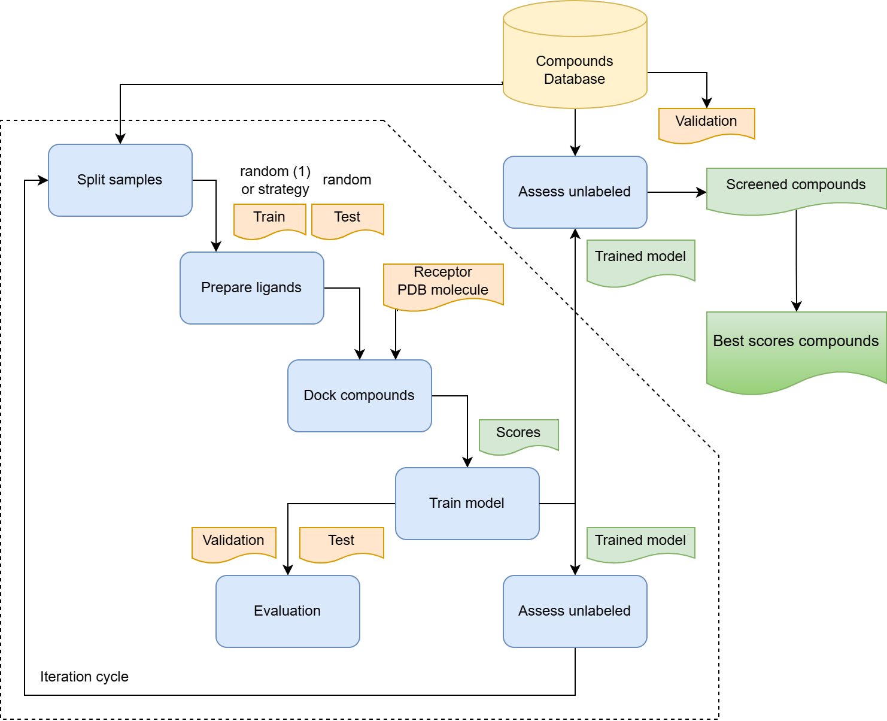

# al-docking

## Introduction

**al-docking** is an active learning-driven molecular docking pipeline that ingests 3D receptor structures and a chemical compound database. It iteratively performs docking simulations and trains machine learning models to prioritize promising ligands, producing docking score prediction results, trained models, and a summary report with progress through iteration figures.

<!-- 
```mermaid
flowchart TB
    subgraph Initialization
        A["Input: Receptors & Compounds"] &ndash; &ndash; &gt; B["Prepare Receptor"]
    end
    subgraph Active Learning
        B &ndash; &ndash; &gt; C["Initial Sampling"]
        C &ndash; &ndash; &gt; D["Docking"]
        D &ndash; &ndash; &gt; E["Train Model"]
        E &ndash; &ndash; &gt; F["Inference & Selection"]
        F &ndash; &ndash; &gt; C
    end
    subgraph Final Screening
        F &ndash; &ndash; &gt; G["Database Inference"]
    end
    subgraph Reporting
        G &ndash; &ndash; &gt; H["Generate Report"]
    end
``` 
-->




The pipeline steps are:
- Receptor preparation: preprocess input receptor target .PDB files.
- Deploy docking cache (optional)
- Split validation sample
- Active learning iterations:
  - Split train (strategy based on uncertainty and scores) and test (random) samples, and remain unlabeled
  - Prepare ligands (MGLTools)
  - Perform docking simulations (QVina)
  - Train the machine learning model (DGL, PyTorch)
  - Infer docking scores and uncertainty for unlabeled sample
- Final database screening: inference on the whole compound library.
- Generate report with figures
- Harvest docking cache (optional)

## Executor

The pipeline uses calculation environment pre-cast with `al-docking` docker image. Build the image and deploy it to your docker image storage/registry.

## Usage

> [!NOTE]
> If you are new to Nextflow and nf-core, please refer to [this page](https://nf-co.re/docs/usage/installation) on how to set-up Nextflow. Make sure to [test your setup](https://nf-co.re/docs/usage/introduction#how-to-run-a-pipeline) with `-profile test` before running the workflow on actual data.

Prepare your input files:

A receptor sheet CSV (`receptorsheet.csv`):

```csv
id,pdb,pocket_config
1IEP,1IEP.pdb,1IEP.STI-A-201.config
1YOM,1YOM.pdb,1YOM.P01-A-1.config
```
Each row represents target receptor config:
- `pdb` file with receptor structure PDB data (without ligand)
- `pocket_config`  file with receptor pocket configuration for ligands' docking

Pocket config file example (1IEP.STI-A-201.config):
```
receptor = 1IEP.pdb

center_x = 14.455
center_y = 75.815
center_z = 36.333

size_x = 66.724
size_y = 108.143
size_z = 111.314
```

A compound database .CSV file (`compounds.csv`):

```csv
ID,SMILES
C001,C(C(=O)O)N
C002,CC(=O)O
...
```

Now, you can run the pipeline with a minimal example:

```bash
nextflow al-docking-1.0.0 \
	--receptor_sheet /input/receptorsheet.csv \
	--cache_path /docking/cache \
	--outdir /path/outdir \
	-params-file /settings/params.json \
	-c /configs/nextflow.config \
```
- `-c nextflow.config` - compound database settings and NextFlow executor settings
- `-params-file` - pipeline parameters

Additional pipeline config with compound database settings (/custom/nextflow.config):
```
params {
  compound_db = "/common/input/Databases/chembl_35/chembl_35-1IEP-4b3238-5000.csv"

  compound_id_col = "ID"
  compound_smiles_col = "SMILES"
  compound_pdb_col = "PDB"
  compound_pdbqt_col = "PDBQT"
}

docker.registry = "docker.dev.gcp.cloud-pipeline.com:443/library/"

process {
    clusterOptions = {
        def memory_per_slot = task.memory.toGiga() / task.cpus.toInteger()
        memory_per_slot = memory_per_slot > 0 ? memory_per_slot : 1
        def memory_resource = "$CP_CAP_GE_CONSUMABLE_RESOURCE_NAME_RAM"
        memory_resource = memory_resource != "[:]" ? memory_resource : "ram"
        "-l $memory_resource=${memory_per_slot}G"
    }
}
```

The pipeline params (/settings/params.json):
```
use_gpu: false
max_iteration_num: 5
train_sample_size: 10000
test_sample_size: 10000
validation_sample_size: 10000
random_seed: 42

prepare_chunk_size: 2000
docking_chunk_size: 500
inference_chunk_size: 5000

model_type: gine
model_num_layers: 4
model_hidden_dim: 128
model_out_dim: 2
model_readout_method: pma
model_dropout_prob: 0.2
train_batch_size: 256
inference_batch_size: 512
train_num_epochs: 35
active_learning_method: ucb
```
- `model_type` ("gcn", "gin", "gine", "gat")
- `model_readout_method` ("sum", "mean", "max", "pma")
- `active_learning_method` train sample strategy ("greedy", "unc" - uncertainty, "ucb" - balanced)

> [!WARNING]
> Please provide pipeline parameters via the CLI or Nextflow `-params-file` option. Custom config files including those provided by the `-c` Nextflow option can be used to provide any configuration _**except for parameters**_; see [docs](https://nf-co.re/docs/usage/getting_started/configuration#custom-configuration-files).

## Credits

The pipeline based on the [repository](https://github.com/jasonkim8652/al_breakdown/blob/main/README.md) described in the paper [Understanding active learning of molecular docking and its applications
](https://arxiv.org/abs/2406.12919), written by Jeonghyeon Kim, Juno Nam and Seogok Ryu. If you have any question, feel free to open an issue or reach out at [jasonkjh@snu.ac.kr](mailto:jasonkjh@snu.ac.kr).

The pipeline is adopted with NextFlow by Aleksandr Tanas [aleksandr_tanas@epam.com](mailto:aleksandr_tanas@epam.com).

## Citations

Kim, J., Nam, J., & Ryu, S. (2024). Understanding active learning of molecular docking and its applications. ArXiv. [https://arxiv.org/abs/2406.12919](https://arxiv.org/abs/2406.12919)

This pipeline uses code and infrastructure developed and maintained by the [nf-core](https://nf-co.re) community, reused here under the [MIT license](https://github.com/nf-core/tools/blob/main/LICENSE).

> **The nf-core framework for community-curated bioinformatics pipelines.**
>
> Philip Ewels, Alexander Peltzer, Sven Fillinger, Harshil Patel, Johannes Alneberg, Andreas Wilm, Maxime Ulysse Garcia, Paolo Di Tommaso & Sven Nahnsen.
>
> _Nat Biotechnol._ 2020 Feb 13. doi: [10.1038/s41587-020-0439-x](https://dx.doi.org/10.1038/s41587-020-0439-x).
